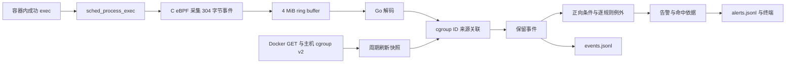

# 设计与讲解

v0.1.0 基线已通过 Ubuntu 首轮验收；本文标注的 v0.2.0 增量按用户要求仅交付源码及文档，本轮未编译、未测试。

## 一条事件怎么成为告警

例如容器执行 `/bin/sh`：内核确认成功 exec 后发出事件；Go 按 cgroup ID 找到 `traceguard-demo`；默认 shell 规则检查来源为 Docker、文件名最后一段为 `sh`；最终告警记录规则 ID、容器名和精确匹配依据。进程很快退出不会影响已经建立的 cgroup 映射。

## 为什么这样选择

| 选择 | 原因 | 代价／边界 |
| --- | --- | --- |
| 成功 exec tracepoint | 只保留成功行为，首版不需要关联 syscall 进入与返回 | 看不到失败尝试、普通 fork 和 shell 内建命令 |
| 固定 tracepoint 布局 | 避免直接读取复杂 task_struct，不需要生成 vmlinux.h | 不是 CO-RE；加载前校验字段偏移，异常布局明确拒绝 |
| 外置 BPF ELF + cilium/ebpf | C 负责内核采集，Go 负责完整用户态流程 | 分发时必须同时带 Go 程序和 `.bpf.o` |
| ring buffer + per-CPU 计数 | 有界缓冲、减少用户态轮询；内核预留失败可见 | ring buffer 满时丢事件，单一指标不覆盖全部漏报 |
| cgroup ID 为主要关联键 | 容器命令可能在读取 `/proc/PID` 前退出；cgroup 比单个进程更长寿 | 只覆盖已发现的容器，新容器存在刷新窗口 |
| Docker 元数据定时快照 | HTTP 工作不进入逐条事件处理路径；代码易解释 | 停止／改名／子 cgroup 变化有延迟 |
| 精确规则 + JSONL | 规则逻辑透明、告警可追溯、无需数据库部署 | 名称规则可被重命名绕过，无行为序列分析 |

依赖固定为 `github.com/cilium/ebpf v0.17.3` 与其运行依赖 `golang.org/x/sys v0.30.0`，前者要求 Go 1.22。选择兼容首版的固定 API，不宣称是最新版本。`go.sum` 已在 2026-09-21 的 Ubuntu 真实构建中生成并保留，应随代码一并维护。

## 数据含义

- `timestamp_ns` 是内核启动后的单调时间；`observed_at` 是 Go 收到并处理事件时的 UTC 时间。后者会受排队延迟影响，不等于精确执行时刻。
- PID/TID 来自主机命名空间，UID/GID 是主机侧真实身份，不是有效 UID/GID；用户命名空间下与容器所见值可能不同。
- `comm` 最多 15 字节；`filename` 最多 255 字节，来自执行请求，不保证规范化绝对路径。
- `source.kind` 为 `docker`、`host` 或 `unknown`。缓存关联后的 docker 表示事件 cgroup 曾与容器对应，不表示容器此刻仍运行。
- 实时事件 ID 由随机运行 ID 与递增序号组成；告警 ID 为事件 ID 加规则 ID，可用 `event_id` 关联两份 JSONL。
- `replay=true` 明确标记回放。合成样例只用于说明用户态逻辑，不能用来证明 eBPF 采集有效。

二进制字段偏移见 [采集 ABI](../bpf/README.md)。容器关联的 inode 来源、缓存 TTL 和降级见 [来源关联说明](../internal/container/README.md)。

## v0.2.0 的小范围完善

规则层参考 Falco 的逐规则例外思想，新增 `exclude_container_names`。`Engine.Evaluate` 先匹配原有全部正向条件，再将已确认 Docker 容器的例外分流为 `ExcludedRules`，其余产生 `Alerts`。原 `Match` 方法保留为返回告警的兼容入口。配置载入仍拒绝拼写错误、重复键和非法值，引擎持有新增名单的独立副本。默认配置未设置例外。

主流程先保存原始事件，再评估规则，统计例外和写入实际告警。这样减少正常维护告警时仍可回看原始行为。`excluded_alerts` 按事件与规则的组合计数，不是丢事件数；例外没有额外的逐条持久化文件，要复核规则决策需保留当时配置并回放。`alerts_by_rule` 在对应告警成功追加后增加。

unknown 原因分类复用已有 `Source.Reason`，不增加 Docker 调用或改变来源判定。分类使用固定键，任意回放文字归到 `other`、空原因归到 `unspecified`，从而保持内存有界。统计仅由现有主处理流程更新，不增加 goroutine 或外部监控服务；详细语义见 [配置说明](../configs/README.md)。

终端输出通过一个小的 `Encode(any) error` 接口选择 JSON 或文本，实时和回放共用。默认保持 JSON，文本只提供便于阅读的单行摘要；完整事件和告警仍由原输出层追加为 JSONL。文本展示参考 libbpf-bootstrap 的简洁事件行形式，由本项目自行实现，字符串统一转义并传播写入错误。

本轮没有升级 cilium/ebpf、改动内核程序、引入新依赖或更换构建方式。继续采用外置 BPF ELF 与 304 字节格式，避免在尚未安排新一轮验证时扩大内核侧变更。三个开源项目与本项目的具体关系见 [开源参考说明](OPEN_SOURCE.md)。

## 并发与生命周期

实时流程保留三个必要职责：一个 goroutine 阻塞读 ring buffer，一个 goroutine 定期更新容器快照，主 goroutine 顺序落盘与匹配规则。用户态队列最多 256 条；慢输出会将背压传回内核环形缓冲，不额外创建无限队列。

启动顺序：校验配置 → 校验运行条件 → 获取 Docker 快照 → 打开日志 → 加载/附加 eBPF → 输出 ready。首次 Docker 快照失败会停止，避免在尚无可用归属信息时悄悄声称正常运行。运行中的刷新错误会报告，旧条目在 5 分钟后过期；超过 30 秒没有完整快照，未命中的宿主候选也保守记为 unknown。

正常停止：取消刷新和队列等待 → 读取 drop 计数 → 解除探针并关闭 reader → 等待后台结束 → 输出统计 → 同步并关闭日志。当前实现不排空积压事件，不能作为无损审计器。第二次退出信号恢复默认行为，处理输出设备长期阻塞的情况。

输出事件先于告警写入。两份文件不构成事务：磁盘故障时可能事件已保存而告警未保存。任一追加错误都会导致主程序停止并报告，之后换新目录继续排错，勿继续向损坏尾行后追加。

## 阅读代码时应能解释的五件事

1. `bpf/exec.bpf.c` 如何从 tracepoint 动态字符串取 filename，为什么 `__data_loc` 要掩码。
2. `internal/collector/decode.go` 为什么按偏移显式解码，而不直接强转 Go struct。
3. `internal/container/resolver_linux.go` 为什么通过 cgroup ID 缓存，什么时候返回 unknown。
4. `internal/rules/engine.go` 如何把字段 AND 与列表 OR 组合，以及为什么告警不是攻击结论。
5. `cmd/traceguard/run.go` 为什么要拆读事件和快照刷新，退出时哪些资源需要释放。

## 简历表述的边界

2026-09-21 已在一台 Ubuntu 24.04.3 x86_64 虚拟机完成真实构建、探针加载与集成验证，
16 项集成检查全部通过。实测环境为内核 7.0.0-31-generic、Go 1.22.2、
Clang 18.1.3、Docker 29.1.3、cgroup v2 / systemd；合成回放另外验证了
3 个事件、1 条 shell 告警及回放标记。具体检查与证据见
[Ubuntu 验证报告](validation/2026-09-21/REPORT.md)。

可据此使用以下项目描述：

> 开发基于 C/eBPF 与 Go 的单机 Docker 运行时监控工具，通过 exec tracepoint 采集进程行为，结合 cgroup v2 与 Docker 元数据关联容器，实现可配置规则告警、JSONL 记录与离线回放。

这段表述对应 v0.1.0 已实现并在上述环境验证的功能；v0.2.0 新增的规则例外、分类统计与文本展示尚未重新验证。尚未进行性能或压力测试，
也未实测 arm64 或其他容器运行时；不要添加未经测量的吞吐量、准确率或攻击覆盖率。
面试例子优先使用验证报告中的实际演示记录和真实排错经历。
